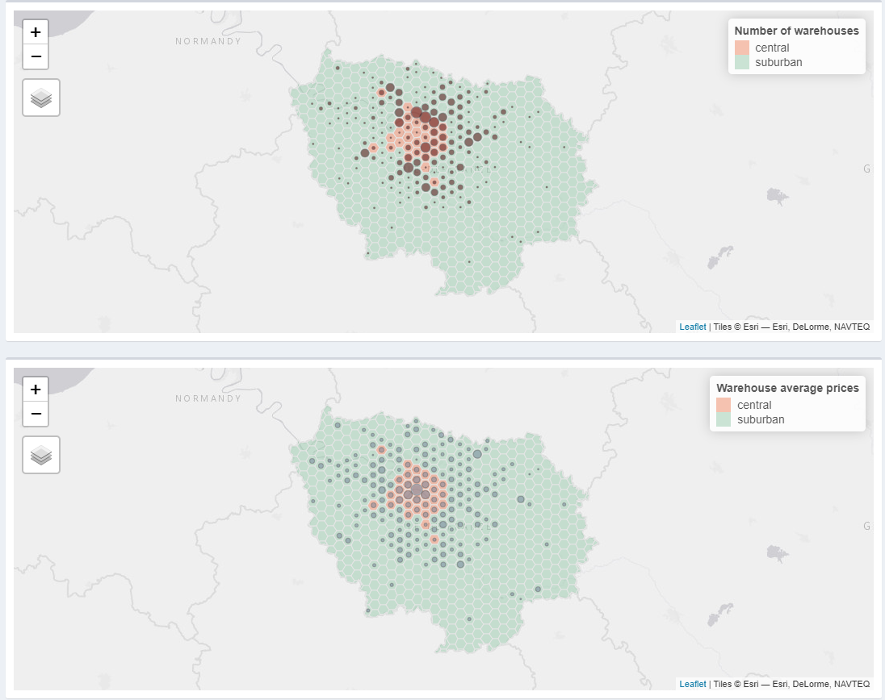
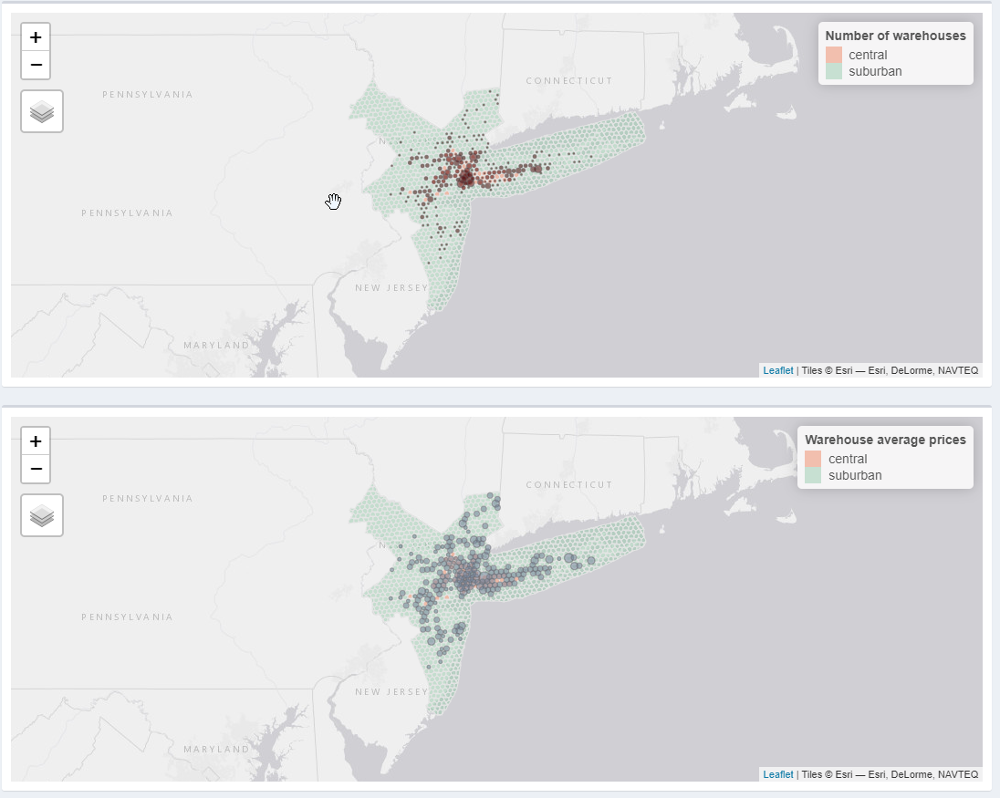

```{r child = "setup.Rmd"}
```

```{r message=FALSE, warning=FALSE, include=FALSE}
library(tidyverse)
library(fontawesome) # from github: https://github.com/rstudio/fontawesome
library(plotly)
```


name: xaringan-title
class: left, middle
background-image: url(img/log7.jpg)
background-size: cover

.larger[
.yellow[
Relações entre centralidades urbanas e a localização de armazéns
]
]

.big[
.off-white[
Renata Oliveira


Mesa-redonda "Logística Urbana nas Cidades Brasileiras: avanços, mudanças e desafios"  

02/06/2022
]]

---

# Autores

```{r echo=FALSE, fig.align='center', message=FALSE, warning=FALSE, out.width='90%'}
knitr::include_graphics('img/banner.png')
```

.center[
.large[
Renata Oliveira   
Laetitia Dablanc   
Matthieu Schorung     

]
]

---

# Hipóteses de pesquisa


.large[
**O espraiamento logístico é maior** nas cidades com um elevado diferencial do **preço da terra** entre **áreas centrais e suburbanas**.
]

.big[
(Dablanc, L., 2019)
]

---

# Hipóteses de pesquisa

.large[
A **localização de armazéns** está relacionada ao **preço praticado pelo mercado imobiliário** em locação de instalações logísticas.
]

.big[
(Dablanc, L., 2019)
]

---

# Desafios metodológicos

.large[
- **Compatibilização** de **métodos** e **dados** para **comparação** de contextos metropolitanos muito diversos
- Coleta de **dados não estruturados**
- Determinação de **centralidades urbanas** para análise da **localização de armazéns** e das **práticas do mercado imobiliário**
]

---

```{r echo=FALSE, message=FALSE, warning=FALSE, out.width="120%", fig.align='center'}
knitr::include_graphics("img/map.png")
```

---

```{r echo=FALSE, fig.align='center', message=FALSE, warning=FALSE, out.height="100%", out.width="105%"}
library(plotly)
load("D:/google_drive/01_postdoc/08_review/scripts/data/img/espraia.rda")
espraia
```

---

# Resultados

.large[
.pull-left[
```{r echo=FALSE, message=FALSE, warning=FALSE, out.width="120%", fig.align='center'}

```
]

.pull-right[
```{r echo=FALSE, message=FALSE, warning=FALSE, out.width="120%", fig.align='center'}

```
]]

---

# Resultados

- Classificar as áreas metropolitanas em uma **tipologia** para realizar estudos **comparativos**; 
- A **localização** e os **preços de locação dos armazéns** estão relacionados à **densidade da atividade urbana**;
- O **espraiamento logístico** **não está** significativamente **relacionado** com o **diferencial nos preços locação de armazéns** em **áreas centrais** e **suburbanas**, mas existem grandes diferenças entre diferentes categorias de regiões metropolitanas. 

???


- Há evidências estatisticamente significativas de que a localização dos armazéns e os preços médios de aluguel não são independentes.

- Considerando todas as regiões metropolitanas, identificamos que o diferencial de valores locação nas áreas central e suburbana não está relacionada ao espraiamento logístico anual. 

Regarding the first hypothesis, which aimed at investigating whether warehouse rent prices were higher in more central places within metropolitan areas, we can state that there is statistically significant evidence that the location of warehouses and average rent prices are not independent. 
We explore the correlation between the differential of rent values in central and suburban areas; and yearly logistics sprawl (second hypothesis). Considering all metropolitan regions, we identify that the null hypothesis (the relationship is not significant) cannot be rejected

Nevertheless, since the metropolitan areas are significantly different in many dimensions, this statement cannot be generalized when we gather them into more similar groups. 

Finally, we conclude that: (i) it is essential to classify metropolitan areas into a typology to perform comparative studies; (ii) warehouse location and prices are related to the density of urban activity; (iii) logistics sprawl is not significantly related to the differential in warehouse rental prices in central and suburban areas, but there are major differences among metropolitan categories. 


---

# Contribuições da pesquisa

.bigger[
**Metodológica:** estrutura inovadora para comparar regiões metropolitanas considerando o padrão espacial das instalações logísticas e as características urbanas. 

**Reprodutibilidade**

**Política pública:** Pode induzir as autoridades públicas locais e regionais ao planejamento integrado.
]

???

a desenvolver políticas públicas mais eficazes voltadas para o uso do solo e o planejamento do transporte orientadas à DUM. A coordenação destas dimensões é essencial para apoiar as necessidades de soluções de logística urbana, de habitabilidade das cidades, de qualidade de vida, do acesso equitativo a bens de consumo e do mercado imobiliário. 
---

# Referências

.midi[
  
[1]	L. Dablanc, D. Rakotonarivo, The impacts of logistics sprawl: How does the location of parcel transport terminals affect the energy efficiency of goods’ movements in Paris and what can we do about it?, Procedia - Soc. Behav. Sci. 2 (2010) 6087–6096. https://doi.org/10.1016/j.sbspro.2010.04.021.
[2]	L. Dablanc, S. Ogilvie, A. Goodchild, Logistics sprawl, Transp. Res. Rec. 2410 (2014) 105–112. https://doi.org/10.3141/2410-12.   
[3]	L. Dablanc, M. Browne, Introduction to special section on logistics sprawl, J. Transp. Geogr. (2019) 0–1. https://doi.org/10.1016/j.jtrangeo.2019.01.010.   
[4]	A. Heitz, L. Dablanc, L.A. Tavasszy, Logistics sprawl in monocentric and polycentric metropolitan areas: the cases of Paris, France, and the Randstad, the Netherlands, REGION. 4 (2017) 93. https://doi.org/10.18335/region.v4i1.158.   
[5]	J. Cidell, Concentration and decentralization: The new geography of freight distribution in US metropolitan areas, J. Transp. Geogr. 18 (2010) 363–371. https://doi.org/10.1016/j.jtrangeo.2009.06.017.   
[6]	T. Sakai, A. Beziat, A. Heitz, Location factors for logistics facilities: Location choice modeling considering activity categories, J. Transp. Geogr. 85 (2020) 102710. https://doi.org/10.1016/j.jtrangeo.2020.102710.   
[7]	OpenStreetMap contributors, Planet dump retrieved from https://planet.osm.org , (2017).   
[8]	S. Shekhar, H. Xiong, Local Indicators of Spatial Association Statistics, Encycl. GIS. 116 (2008) 615–615. https://doi.org/10.1007/978-0-387-35973-1_701. ]
---

# Referências

.midi[
[9]	A. Luc, Spatial econometrics: methods and models, Kluwer Academic., Dordrecht, 1988.   
[10]	R.H.M. Pereira, V. Nadalin, L. Monasterio, P.H.M. Albuquerque, Urban Centrality: A Simple Index, Geogr. Anal. 45 (2013) 77–89. https://doi.org/10.1111/gean.12002.   
[11]	A. Regal, J. Gonzalez-Feliu, M. Rodriguez, M. Juganaru-Mathieu, Defining urban logistics profile zones in South American metropolis by combining functional and spatial clustering techniques, 2019 Int. Conf. Control. Autom. Diagnosis, ICCAD 2019 - Proc. (2019) 1–6. https://doi.org/10.1109/ICCAD46983.2019.9037890.   
[12]	Y. Wang, C. Hao, D. Liu, The spatial and temporal dimensions of the interdependence between the airline industry and the Chinese economy, J. Transp. Geogr. 74 (2019) 201–210. https://doi.org/10.1016/j.jtrangeo.2018.11.020.   
]


---

class: middle, inverse

.pull-left[
```{r echo=FALSE, message=FALSE, warning=FALSE, out.width="55%"}

```
]


.pull-right[
.larger[
.center[
Obrigada!
]]
]

<hr />

&nbsp;

<p style="text-align: center;"><span style="color: #ebdb00;"><em>renataoliveira@gmail.com</em></span></p>

<!-- Add icon library -->
<link rel="stylesheet" href="https://cdnjs.cloudflare.com/ajax/libs/font-awesome/4.7.0/css/font-awesome.min.css">

<link rel="stylesheet" href="https://cdn.jsdelivr.net/gh/jpswalsh/academicons@1/css/academicons.min.css">


<!-- Add font awesome icons -->
<p style="text-align: center;">
    <a href="https://twitter.com/retaoliveira?lang=en" class="fa fa-twitter fa-2x"></a>&nbsp;&nbsp;
    <a href="https://github.com/retaoliveira" class="fa fa-github fa-2x"></a>&nbsp;&nbsp;
    <a href="https://scholar.google.com/citations?user=V6EX45EAAAAJ" class="ai ai-google-scholar ai-2x"></a>&nbsp;&nbsp;
    <a href="https://orcid.org/0000-0002-9011-2342" class="ai ai-orcid ai-2x"></a>&nbsp;&nbsp;
    <a href="http://lattes.cnpq.br/2642488704355833" class="ai ai-lattes ai-2x"></a>&nbsp;&nbsp;
    <a href="https://github.com/retaoliveira/relements/raw/main/texto/index.pdf" class="ai ai-cv ai-2x"></a>

</p>

&nbsp;
